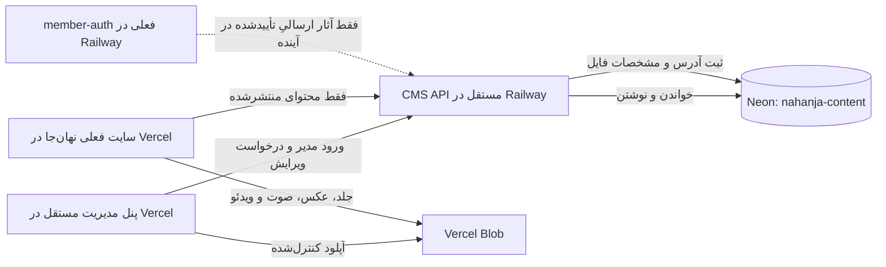

# استقرار پیشنهادی پنل مستقل نهان‌جا

این نقشه بر inventory سایت زنده در [گزارش بررسی](nahanja-admin-audit.md) و commit `4009b3c70729b832ecaaa1606c49158b3267521e` تکیه دارد. هدف، حفظ تمام محتوای فعلی و امکان افزودن نوع محتوا و سکشن تازه بدون تغییر دوباره ساختار اصلی دیتابیس است.

## تصمیم‌های اجرایی

| بخش | محل | دلیل |
|---|---|---|
| داده تحریریه و نسخه‌ها | پروژه Neon مستقل `nahanja-content` | جداسازی از اطلاعات اعضا؛ Postgres رابطه‌ای با رشد نوع محتوا، نسخه و انتشار |
| شاخه‌ها | شاخهٔ اصلی Neon و `staging` | آزمودن migration و seed قبل از شاخهٔ اصلی؛ URL مستقل برای هر شاخه |
| API مدیریت | سرویس Railway مستقل `nahanja-cms-api`، ترجیحاً پروژه جدا از `nahanja-members` | اجرای CRUD، نقش‌ها، اعتبارسنجی، انتشار و audit به‌شکل متمرکز |
| رابط پنل | پروژه Vercel مستقل، دامنه‌ای مانند `admin.nahanja...` پس از تعیین دامنه واقعی | چرخه انتشار و مجوزهای جدا از سایت عمومی |
| سایت فعلی | پروژه Vercel موجود `prj_2HK2SmRvWnw28APC76dMLfF0X5Pp` | ابتدا خروجی فعلی حفظ، سپس دریافت release منتشرشده از CMS API |
| مدیا | Vercel Blob؛ در Neon فقط شناسه، آدرس و metadata | فایل بزرگ در Postgres قرار نگیرد؛ یک جلد برای تمام محل‌های نمایش |
| عضویت فعلی | Railway پروژه `nahanja-members`، سرویس `member-auth` | ورود عضو عادی از ورود مدیر جدا می‌ماند |

سرویس Railway موجود متغیرهای `DATABASE_URL`, `DATABASE_URL_UNPOOLED`, `AUTH_PUBLIC_ORIGIN` و متغیرهای Google را دارد. مقدار آن‌ها به اتصال فعلی تعلق دارد و خوانده یا جابه‌جا نشده است. دیتابیس محتوایی پیشنهادی باید connection string و credential مستقل داشته باشد. چون CMS API تنها مصرف‌کننده مستقیم دیتابیس است، پنل و سایت عمومی به رمز Neon نیاز ندارند.

## مدل ورودی داده

مبنای طرح، فایل [DDL دیتابیس](nahanja-content-neon.sql) است. هر محتوا یک `content_item` با `kind` و `stable_key` دارد؛ کتاب، تجربه، جهان، حال‌وهوا، مجموعه، عکس، اثر عضو، صفحه و سکشن از این مدل استفاده می‌کنند. متن و مشخصات هر ویرایش در `content_revision.payload` به‌صورت JSONB نسخه‌دار نگه داشته می‌شود. پیوندهای مهم، مانند تجربه ← کتاب یا صفحه Home ← تجربه، در `revision_relation` با کلید خارجی ثبت می‌شوند. مدیا در `media_asset` و محل استفاده آن در `revision_media` است.

این روش دو مزیت دارد: نوع جدید محتوا با افزودن `content_type` و قرارداد اعتبارسنجی API قابل اضافه‌کردن است؛ در عین حال، رابطه‌ها و ترتیب نمایش در جدول رابطه‌ای می‌مانند و به رشته‌های آزاد وابسته نیستند. JSONB مجوز ورود هر داده‌ای نیست: API برای هر `kind` و `schema_version` باید اعتبارسنجی مستقل، محدودیت طول، مقصدهای مجاز و escape خروجی داشته باشد.

`publication_release` و `release_entry` یک نسخه کامل و سازگار از محتوا می‌سازند. سایت فقط release فعال را می‌خواند؛ draft در پنل قابل preview است و به‌صورت ناخواسته روی سایت ظاهر نمی‌شود. `active_release` در یک تراکنش جابه‌جا می‌شود تا کتاب، جلد، Experience و سکشن Home از دو نسخه مختلف مخلوط نشوند. حذف معمولی با `deleted_at` و بازیابی انجام می‌شود؛ نسخه‌های قبلی و audit باقی می‌مانند.

مدل، سقف تعداد کتاب یا تجربه ندارد. ترتیب و عضویت فهرست‌ها از `revision_relation.ordinal` می‌آید؛ تعدادهای نمایشی باید از داده واقعی محاسبه شوند. پادکست‌های موجود فعلاً همان Experienceهای با `format=listen` هستند. نوع `podcast` و `video` برای محتوای مستقل آینده در `content_type` ثبت شده اما محتوای فرضی برای آن‌ها ساخته نمی‌شود.

## داده‌های اولیه آماده

[اسکریپت seed](nahanja-content-seed.sql) از [snapshot تأییدشده سایت](nahanja-content-snapshot.json) تولید شده است: **۴۶ رکورد، ۱۰۵ رابطه، ۳۹ رکورد منتشرشده و ۷ رکورد آرشیوی**. رکوردهای منتشرشده شامل ۳ کتاب، ۸ تجربه، ۵ جهان، ۴ حال‌وهوا، نویسندگان، کارت‌های Home، عکس‌های تحریریه و صفحات اصلی‌اند. ۳ مجموعه قدیمی و ۴ صدای جامعه در آرشیو می‌مانند. داده‌های قدیمی `lib/mock-data.ts` که در سایت فعال نیستند به‌عنوان محتوای زنده وارد نمی‌شوند.

Seed با `stable_key` و `ON CONFLICT` طراحی شده تا اجرای مجدد، ویرایش‌های بعدی مدیر یا release فعال را بازنویسی نکند. فایل‌ها در پروژهٔ مستقل Neon ابتدا روی `staging` و سپس روی شاخهٔ اصلی اجرا و شمارش/رابطه‌ها بررسی شده‌اند.

این seed داده‌های ساختاری و متن اصلی ۷ صفحه را ثبت می‌کند. پیام‌های ریز رابط، متن کامل صفحه درباره/همراهی و تنظیمات ظاهری هنوز از HTML فعلی سرو می‌شوند؛ در مرحله اتصال CMS باید آن‌ها نیز با `ui_copy`/`page` نسخه‌دار شوند. تا آن زمان، فایل زنده سایت بدون تغییر باقی می‌ماند و هیچ متن پیش‌فرضی از بین نمی‌رود.

فرم‌های ورود داده در پنل باید برای نوع‌های فعلی چنین باشند:

| نوع | ورودی‌های ضروری | ورودی‌های قابل‌افزودن |
|---|---|---|
| کتاب | عنوان، نویسنده، معرفی، جلد یا قالب جلد فعلی، تجربه‌های مرتبط | مترجم، ناشر، شابک، فصل، نسخه صوتی، برچسب |
| تجربه | عنوان، متن مرتب، سؤال، کتاب و جهان، حال‌وهوا، قالب و زمان | صوت، تصویر، ویدئو، پیوندهای بیشتر، زمان انتشار |
| جهان و دالان | عنوان، توضیح، کلمات، مقصدها و ترتیب | تصویر، ویدئو، زیرمجموعه، سکشن اختصاصی |
| مجموعه | عنوان، توضیح، تصویر، اعضای مرتب | هر نوع محتوای تازه‌ای که renderer آن را پشتیبانی کند |
| عکس/پادکست/ویدئو | عنوان، توضیح، مدیا، متن جایگزین و وضعیت انتشار | کتاب/جهان/تجربه مرتبط، چند فایل، فصل یا اپیزود |
| Home و صفحه‌ها | عنوان/متن، سکشن‌های فعال، محتوا و ترتیب هر سکشن | سکشن تازه با `kind`، نسخه schema و component مربوط |

افزودن نوع محتوای تازه در دیتابیس با `content_type` ممکن است؛ نمایش عمومی آن همچنان به component و قرارداد API همان نوع نیاز دارد. این مرز از انتشار رکوردی که سایت هنوز نمی‌تواند نمایش دهد جلوگیری می‌کند.

## اتصال‌ها و متغیرها

| محل | متغیر | کاربرد |
|---|---|---|
| Railway / CMS API | `DATABASE_URL` | اتصال pooled به Neon برای درخواست‌های عادی |
| Railway / migration job | `DATABASE_URL_UNPOOLED` | اتصال direct برای migration و backup؛ فقط در محیط اجرای migration |
| Railway / CMS API | `ADMIN_OIDC_ISSUER`, `ADMIN_OIDC_AUDIENCE`, `ADMIN_OIDC_JWKS_URL` | اعتبارسنجی نشست مدیریتی؛ مقادیر پس از انتخاب provider مشخص می‌شوند |
| Railway / CMS API | `CORS_ADMIN_ORIGIN`, `PUBLIC_SITE_ORIGIN` | فهرست دقیق originهای مجاز؛ wildcard استفاده نشود |
| Vercel / Admin | `CMS_API_URL` | آدرس API مدیریت Railway؛ بدون connection string دیتابیس |
| Vercel / Admin | `BLOB_READ_WRITE_TOKEN` | فقط سمت سرور یا توکن آپلود کوتاه‌مدت برای Blob |
| Vercel / سایت عمومی | `CONTENT_API_URL` | خواندن release منتشرشده؛ برای draft مجوزی ندارد |

کلید مدیر را از نشست `nahanja_member` استنتاج نکنید. مدیران در `admin_account` به شناسه provider معتبر و نقش وصل می‌شوند؛ هیچ مدیر پیش‌فرض یا رمز در seed ساخته نشده است. public endpoint باید فقط release فعال را برگرداند. دسترسی ویرایش روی سرور کنترل شود، نه صرفاً با پنهان‌کردن دکمه‌ها در پنل.

برای بارگذاری فایل، رابط پنل از Vercel Blob آپلود مستقیم با token محدود دریافت کند. CMS API پس از بررسی نوع واقعی، اندازه، checksum و حق دسترسی، `media_asset` را آماده علامت بزند. جایگزینی جلد، یک revision جدید کتاب با رابطه `revision_media(slot='cover')` می‌سازد؛ همه چهار محل جلد از همان رابطه می‌خوانند. فایل بدون استفاده تا پایان دوره بازیابی پاک نشود. [Vercel Blob](https://vercel.com/docs/vercel-blob) فایل‌های تصویر، صوت و ویدئو و upload مستقیم را پشتیبانی می‌کند.

در Neon، `DATABASE_URL` pooled برای ترافیک برنامه و `DATABASE_URL_UNPOOLED` direct برای migration پیش‌بینی شده‌اند؛ [راهنمای Neon](https://neon.com/docs/connect/connection-pooling) و مهارت نصب‌شده Neon این تفکیک را توصیه می‌کنند. ناحیهٔ `aws-eu-central-1` برای پروژهٔ تازه انتخاب شده، زیرا پروژهٔ موجود `nahanja` در همان حساب Neon در همین ناحیه قرار دارد؛ منطقهٔ سرویس Railway و اجرای Vercel هنوز تأیید نشده است.

## ترتیب عملی اجرا

1. پروژه Neon مستقل و branch آزمایشی ایجاد شد؛ شناسه پروژه/شاخه و region در پایین ثبت است.
2. DDL و seed در staging و شاخهٔ اصلی اجرا شد؛ صحت ۴۶ رکورد، ۱۰۵ رابطه، release فعال، ۳ کتاب و ۸ تجربه تأیید شد. داده و schema موجود عضویت هیچ تغییری نکرد.
3. کد اولیهٔ CMS API و پنل در `../nahanja-admin/` ساخته شده است؛ API محلی با Neon staging آزموده شد. پروژهٔ Railway مستقل `nahanja-cms-api` و سرویس خالی `cms-api` ساخته شدند. هنوز منبع کد و دامنهٔ API به سرویس متصل نیستند.
4. کد پنل با build موفق آماده است. برای استقرار مستقل Vercel، منبع GitHub یا دسترسی deploy، دامنهٔ پنل و Blob store لازم است. preview داخل پنل ساخته شده؛ preview همان صفحهٔ سایت عمومی به adapter سایت نیاز دارد.
5. سایت عمومی ابتدا adapter خواندن release را با fallback کنترل‌شده به نسخه ثابت فعلی دریافت کند؛ سپس تغییرات واقعی پنل در preview و production آزمایش شوند. سایت فعلی هنوز به API جدید وصل نشده است.
6. پس از آزمون API و پنل در staging، service و envهای production به شاخهٔ اصلی Neon وصل و یک تغییر قابل‌بازگشت منتشر شود. rollback از `publication_release` انجام شود.

## وضعیت دسترسی در زمان تهیه

دسترسی خواندنی Vercel و Railway برقرار بود. Vercel deployment `dpl_53x8PaxrAv5hXmXP9XD5Wt4xY3Mi` روی commit بررسی‌شده `READY` است. Railway `member-auth` نیز `SUCCESS` است. پس از ورود از طریق CLI رسمی Neon، پروژهٔ مستقل `nahanja-content` با شناسهٔ `lucky-wave-16672147`، دیتابیس `nahanja_content`، PostgreSQL 17 و ناحیهٔ `aws-eu-central-1` ایجاد شد. شاخهٔ آزمایشی `staging` شناسهٔ `br-quiet-feather-b1wlx1wk` دارد؛ شاخهٔ اصلی اولیه `br-delicate-heart-b1jbwv6m` است. DDL و seed روی هر دو شاخه با اتصال مستقیم اعمال شدند و در هر دو شمارش `۴۶ content_item / ۱۰۵ revision_relation / ۳۹ release_entry / ۱ active_release / ۳ book` به دست آمد. حساب Google مدیر اولیه `amirhfz95@gmail.com` به‌صورت pending ثبت شد. رشته‌های اتصال و رمزها در این سند ذخیره نشده‌اند.

پروژه Railway مستقل `nahanja-cms-api` شناسهٔ `d9fd10cf-e350-4266-ae0e-a9dedce4b729` و سرویس `cms-api` شناسهٔ `ab2cdaee-a2db-43d6-b9d8-1249ac7963b3` دارد. `DATABASE_URL` pooled و `GOOGLE_CLIENT_ID` روی سرویس ثبت شده‌اند، ولی سرویس خالی و منتشرنشده است. Vercel CLI در این محیط ابتدا با محدودیت مسیر تنظیمات و سپس با خطای ارتباطی login مواجه شد. پروژهٔ Vercel پنل هنوز ساخته نشده است. تصمیم دربارهٔ محل GitHub کد و تنظیم Google authorized origin و Blob store مانده است.

DDL و seed در یک اجرای محلی PostgreSQL سازگار نیز آزموده شدند. اجرای seed برای بار دوم، شمار رکوردها و release فعال را تغییر نداد: ۴۶ محتوا، ۱۰۵ پیوند، ۳۹ مورد در release و ۳ کتاب با revision معتبر. `pgcrypto` فقط در اجرای محلی PGlite حذف شد، چون `gen_random_uuid` در آن داخلی است؛ روی Neon همان DDL اصلی اجرا شده است.

